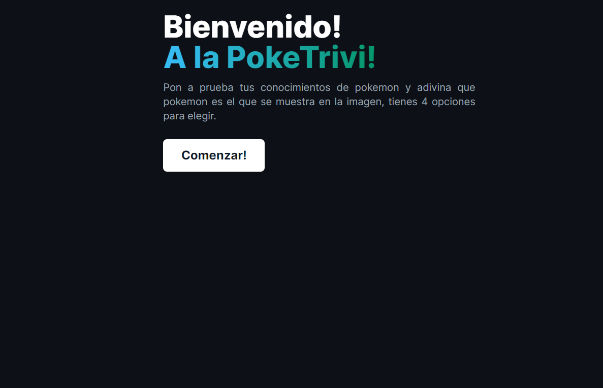
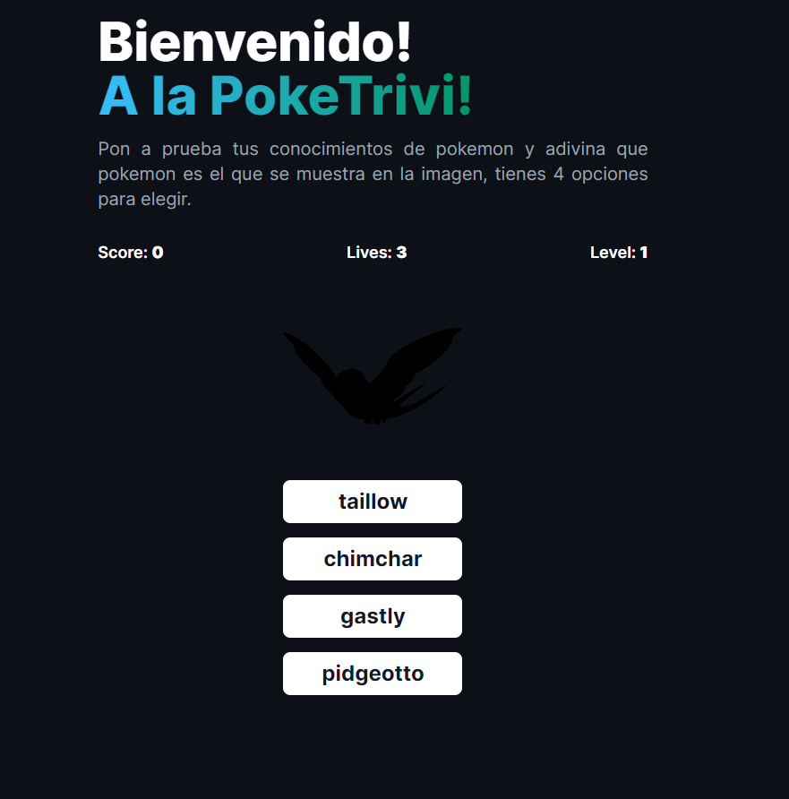
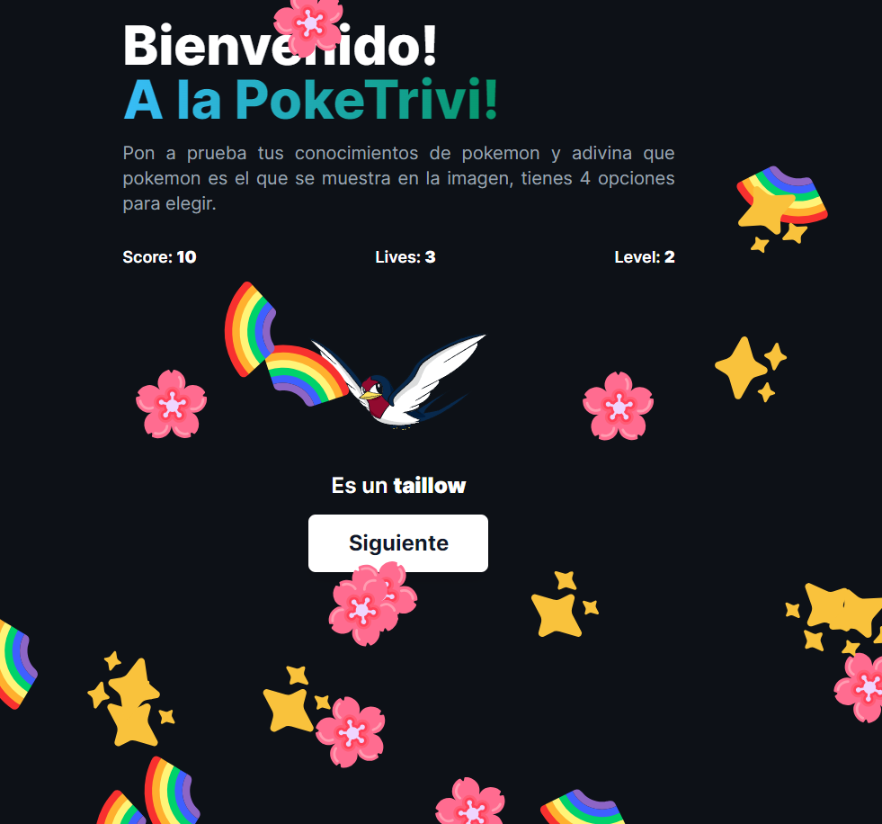
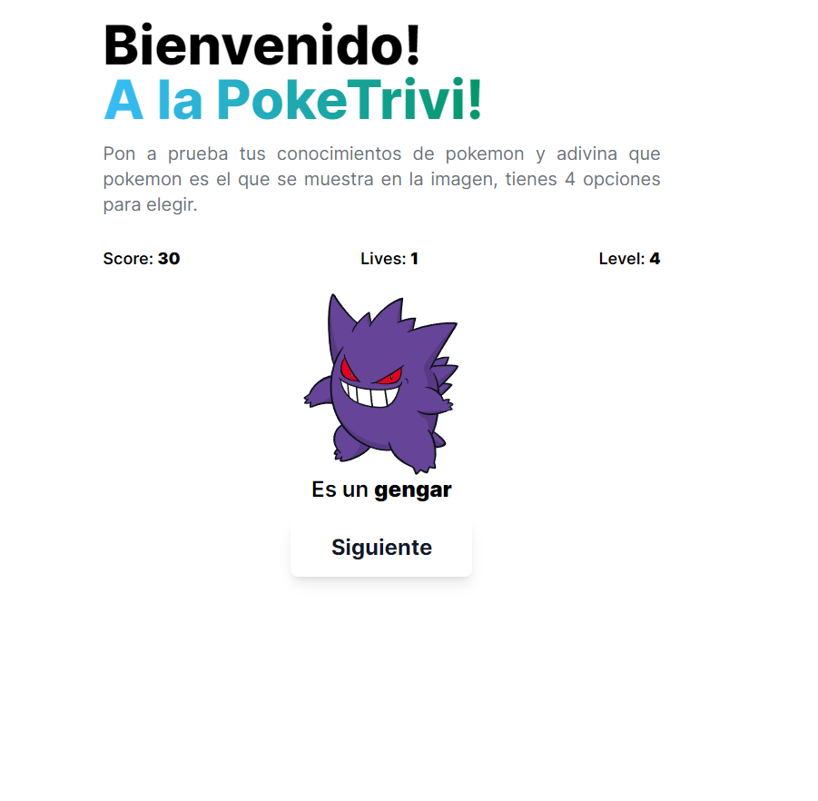
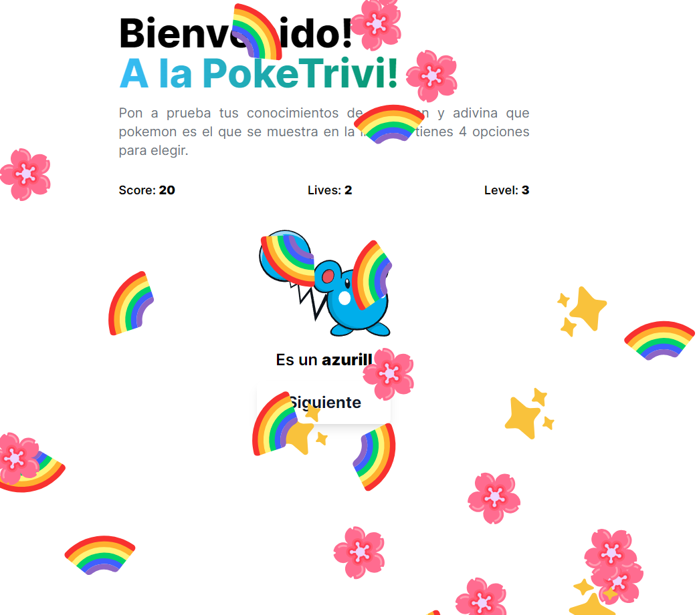

# PokeTrivi 😎

Pon a prueba tus conocimientos de pokemon y adivina que pokemon es el que se muestra en la imagen, tienes 4 opciones para elegir. Cada respuesta correcta sumará 10 puntos a tu **score** pero cada equivicación te restará una **vida**, responde bien 5 preguntas consecutivas y obtendrás una vida extra. **¿A cuanto podrás llegar?**


## Herramientas de desarrollo

 - Next Js
- [PokeApi](https://pokeapi.co/)
 - Zustand
 - Tailwind CSS
 - Typescript


## ¿Cómo levantar el proyecto?

Es sencillo, realiza un git clone del proyecto después ejecuta los siguientes comandos:

```bash
  cd ./project-folder
```

```bash
  npm install
```

```bash
  npm run dev
```


## Authors

- [@githubpopckorn](https://github.com/githubpopckorn)


## Feedback

Si tienes algun feedback o recomendación puedes encontrarme en santy_lopez@live.com.ar


## 🚀 About Me
Full stack developer...


## License

[MIT](https://choosealicense.com/licenses/mit/)


<div style="text-align:center">

<h2>Tenemos un modo oscuro 😎</h2>




<h2>Y un modo claro 🤩</h2>



</div>

## Deploy on Vercel

The easiest way to deploy your Next.js app is to use the [Vercel Platform](https://vercel.com/new?utm_medium=default-template&filter=next.js&utm_source=create-next-app&utm_campaign=create-next-app-readme) from the creators of Next.js.

Check out our [Next.js deployment documentation](https://nextjs.org/docs/deployment) for more details.
